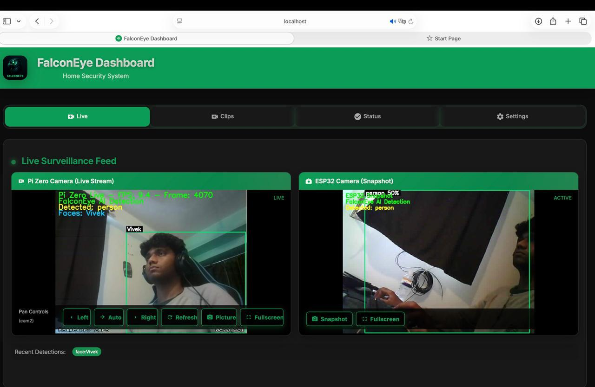
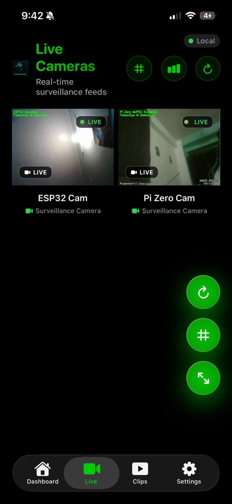
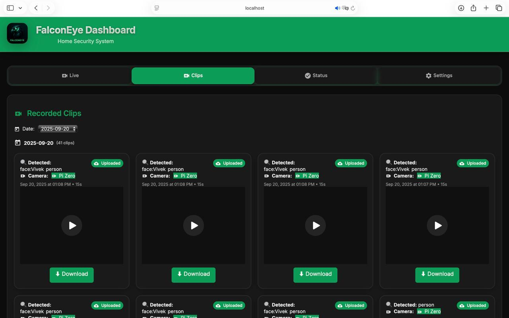
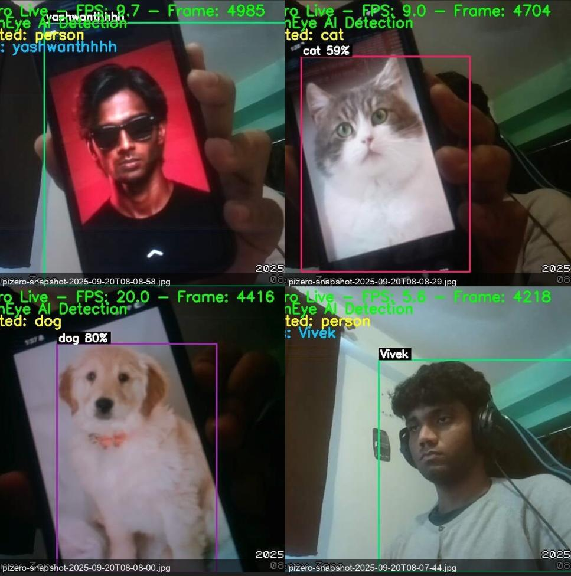
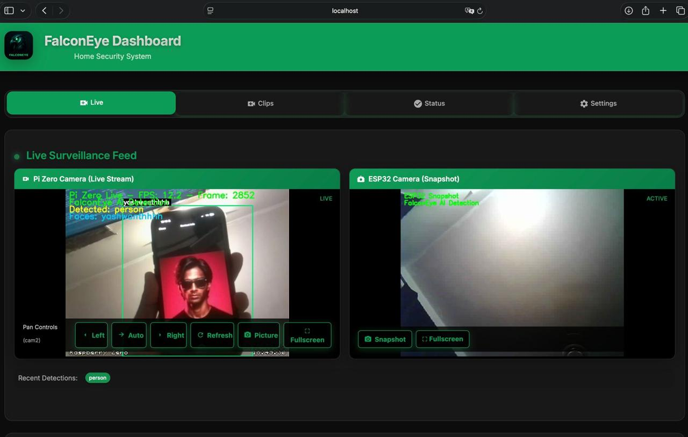
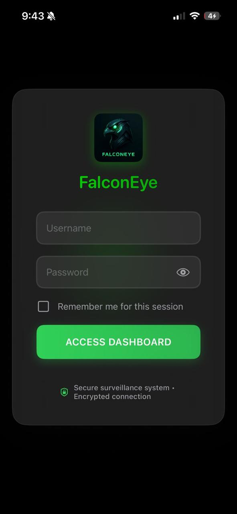
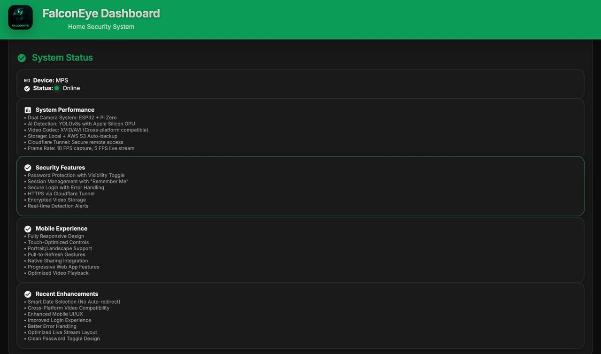
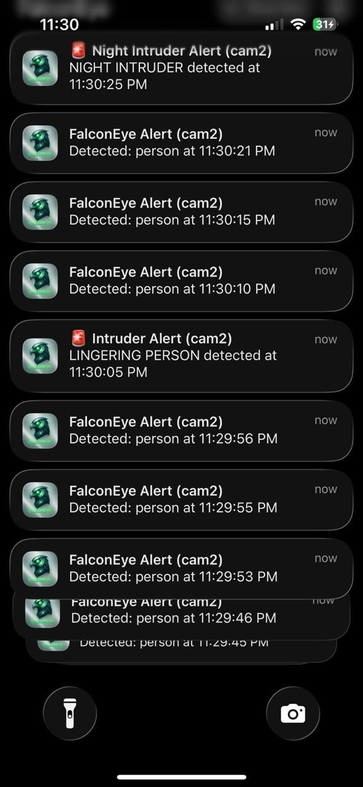

# FalconEye - AI-Powered Home Security System

[](https://www.python.org/)
[](https://flask.palletsprojects.com/)
[](https://ultralytics.com/)
[](LICENSE)
[](https://github.com/Vivek9454/FalconEye/actions)

<div align="center">
  
  <h3>Real-time AI-powered home security system with object detection and face recognition</h3>
</div>

A comprehensive, AI-powered home security system with real-time object detection, mobile apps, and cloud integration.

## Quick Start (5-Minute Demo)

**Requirements**: Python 3.11+, 8GB RAM (CPU) or GPU with 4GB VRAM recommended

```bash
# 1. Clone and setup
git clone https://github.com/Vivek9454/FalconEye.git
cd FalconEye
python3 -m venv venv
source venv/bin/activate  # Windows: venv\Scripts\activate
pip install -r requirements.txt

# 2. Download models (or they'll auto-download on first run)
./scripts/download_models.sh yolov8n.pt

# 3. Run quick demo on test image
python run_demo.py --image samples/test.jpg

# 4. Start full backend (optional)
python backend.py
```

**Expected runtime**: 
- Model download: ~10 seconds (yolov8n.pt, 6MB)
- Demo detection: ~2-5 seconds (CPU) or ~0.5 seconds (GPU)
- Full backend startup: ~30-60 seconds

**Docker Quick Demo**:
```bash
docker build -t falconeye-demo .
docker run -p 3001:3001 falconeye-demo
```

See [Full Installation Guide](#installation) for detailed setup.

## Screenshots

### Web Dashboard

*Main dashboard with live camera feeds and object detection*


*Real-time camera feed with AI object detection overlays*


*Recorded security clips organized by date with filtering*


*YOLO object detection in action - detecting person, car, and dog*


*Face recognition identifying known individuals*

### iOS App

*iOS app home screen with modern design*


*Secure login interface*


*System status and configuration*

### Notifications

*Real-time push notifications for security alerts*


*Various notification types: intruder alerts, person detection, etc.*

### Features Showcase

*Dual camera setup with simultaneous detection*


*Advanced system configuration and settings*

See [docs/screenshots/](docs/screenshots/) for more screenshots.

## Features

### Core Security Features
- **AI Object Detection**: YOLOv8-powered real-time detection with 90% false alarm reduction
- **Smart Filtering**: Only detects home surveillance relevant objects (person, car, dog, etc.)
- **High-Speed Capture**: 10 FPS frame capture from ESP32 camera
- **Video Recording**: Automatic recording when objects detected
- **Push Notifications**: Real-time alerts via Firebase Cloud Messaging
- **Cloud Storage**: AWS S3 integration for video clips

### Mobile Optimizations
- **Responsive Design**: Works perfectly on all screen sizes
- **Touch Navigation**: Swipe between Live, Clips, Status tabs
- **Bandwidth Optimization**: 50% less data usage on mobile
- **Auto-Detection**: Automatically detects mobile devices
- **Quality Adjustment**: Lower quality for mobile to save bandwidth
- **Progressive Loading**: Images load with smooth transitions
- **Dark Mode**: Automatic dark theme support

### Cloud & Access
- **Permanent Tunnel**: Always-available cloud access via Cloudflare
- **Custom Domain**: https://cam.falconeye.website
- **SSL Security**: Encrypted connections
- **Global CDN**: Fast access worldwide
- **Mobile APIs**: Optimized endpoints for mobile apps

## System Architecture

```
┌─────────────────┐
│  Mobile Web App │
│  (React/Vite)   │
└────────┬────────┘
         │ HTTP/HTTPS
         ▼
┌─────────────────┐
│  Flask Backend  │
│   (Python 3.8+) │
└────────┬────────┘
         │
    ┌────┴────┐
    ▼         ▼
┌────────┐ ┌──────────┐
│ ESP32  │ │ YOLO AI  │
│ Camera │ │ Detection│
└────────┘ └──────────┘
    │
    ▼
┌──────────┐
│ AWS S3   │
│ Storage  │
└──────────┘
```

## Quick Start

### Requirements

**System Requirements**:
- **Python**: 3.11+ (3.8+ supported but 3.11+ recommended)
- **RAM**: 8GB minimum (CPU) or 4GB VRAM (GPU)
- **Storage**: ~5GB free space (for models and clips)
- **Camera**: ESP32 camera or compatible IP camera (optional for demo)
- **GPU** (optional but recommended):
  - NVIDIA GPU with CUDA support (10x faster inference)
  - Apple Silicon (M1/M2/M3) with MPS support
  - CPU mode available but slower (~100-800ms per frame)

**Model Sizes & Download**:
- `yolov8n.pt`: 6MB - Fastest, good for demos (~10ms GPU, ~100ms CPU)
- `yolov8s.pt`: 22MB - Recommended balance (~15ms GPU, ~200ms CPU)
- `yolov8m.pt`: 52MB - More accurate (~25ms GPU, ~400ms CPU)
- `yolov8l.pt`: 87MB - High accuracy (~40ms GPU, ~600ms CPU)
- `yolov8x.pt`: 136MB - Maximum accuracy (~60ms GPU, ~800ms CPU)

**Download models**:
```bash
# Download recommended models
./scripts/download_models.sh

# Or download specific model
./scripts/download_models.sh yolov8n.pt
```

Models auto-download on first use if not present.

#### Hardware Requirements by Model

| Model | Size | RAM (CPU) | RAM (GPU) | Inference Time (CPU) | Inference Time (GPU) |
|-------|------|-----------|-----------|---------------------|---------------------|
| yolov8n.pt | 6MB | 2GB | 1GB | ~100ms | ~10ms |
| yolov8s.pt | 22MB | 4GB | 2GB | ~200ms | ~15ms |
| yolov8m.pt | 52MB | 6GB | 3GB | ~400ms | ~25ms |
| yolov8l.pt | 87MB | 8GB | 4GB | ~600ms | ~40ms |
| yolov8x.pt | 136MB | 12GB | 6GB | ~800ms | ~60ms |

**Recommended**: `yolov8s.pt` for detection, `yolov8n.pt` for live stream

### Installation

1. **Clone the repository**
   ```bash
   git clone https://github.com/Vivek9454/FalconEye.git
   cd FalconEye
   ```

2. **Set up Python environment**
   ```bash
   python3 -m venv venv
   source venv/bin/activate  # On Windows: venv\Scripts\activate
   pip install --upgrade pip
   pip install -r requirements.txt
   ```

3. **Download AI Models**
   
   Models are automatically downloaded on first run, but you can pre-download them:
   
   ```bash
   # Download recommended models
   wget https://github.com/ultralytics/assets/releases/download/v8.2.0/yolov8s.pt -O yolov8s.pt
   wget https://github.com/ultralytics/assets/releases/download/v8.2.0/yolov8n.pt -O yolov8n.pt
   ```
   
   **Model Sizes**:
   - `yolov8n.pt`: ~6MB (nano - fastest, least accurate)
   - `yolov8s.pt`: ~22MB (small - recommended)
   - `yolov8m.pt`: ~52MB (medium)
   - `yolov8l.pt`: ~87MB (large)
   - `yolov8x.pt`: ~136MB (extra large - most accurate)
   
   Models are stored in the project root and automatically loaded.

4. **Configure environment variables**
   ```bash
   # Copy example environment file
   cp .env.example .env
   
   # Edit .env with your settings
   nano .env  # or use your preferred editor
   ```
   
   **Required settings**:
   ```bash
   FALCONEYE_SECRET=your-secure-secret-key-here
   CAM1_URL=http://your-camera-ip/jpg
   ```
   
   **Optional settings**:
   - AWS credentials for S3 storage
   - Firebase credentials for push notifications
   - Model selection (defaults to yolov8s.pt)

5. **Set up frontend (optional)**
   ```bash
   cd falconeye-react-frontend
   npm install
   npm run build
   ```

6. **Start the backend**
   ```bash
   # Option 1: Enhanced startup (recommended)
   ./start_enhanced.sh
   
   # Option 2: Manual startup
   python backend.py
   
   # Option 3: Using Docker (see Docker section)
   docker-compose up
   ```

7. **Access the dashboard**
   - Local: http://localhost:3001
   - Cloud: https://cam.falconeye.website (if tunnel configured)

### First Run

On first startup, the system will:
1. Download YOLO models automatically (if not present)
2. Detect available GPU/CPU device
3. Test camera connectivity
4. Initialize face recognition (if enabled)
5. Start background detection loop

**Expected startup time**: 30-60 seconds (depending on model download and device)

## Configuration

### Network Profiles
Edit `backend.py` to configure your camera IPs:

```python
NETWORK_PROFILES = [
    {
        "name": "home",
        "cameras": {
            "cam1": "http://YOUR_CAMERA_IP/jpg",
            "cam2": "http://YOUR_CAMERA_IP:8081/",
        },
        "esp_pan_base": "http://YOUR_ESP32_IP",
    },
]
```

Or use environment variables:
```bash
export CAM1_URL="http://10.103.190.6/jpg"
export CAM2_URL="http://10.103.190.170:8081/"
export ESP_PAN_BASE_URL="http://10.103.190.58"
```

### Vision Settings
Configure detection settings in `vision_settings.json`:
- Enable/disable object classes
- Adjust detection sensitivity
- Configure face recognition
- Customize overlay colors

### AWS S3 Setup (Optional)
1. Create an S3 bucket
2. Set up IAM user with S3 access
3. Add credentials to environment:
   ```bash
   export AWS_ACCESS_KEY_ID="your_key"
   export AWS_SECRET_ACCESS_KEY="your_secret"
   export AWS_REGION="us-east-1"
   export AWS_S3_BUCKET="your-bucket-name"
   ```

### Firebase Setup (Optional)
See `FIREBASE_SETUP_INSTRUCTIONS.md` for detailed setup.

## Mobile Apps

### iOS App
- Located in `ios/FalconEye/`
- Built with SwiftUI
- Requires Xcode 15.0+
- See `ios/FalconEye/README.md` for setup

### Android App
- Located in `android_app/`
- Built with Kotlin/Java
- See `ANDROID_SETUP.md` for setup

## API Endpoints

### Authentication
- `POST /auth/login` - User login
- `GET /logout` - User logout

### Camera
- `GET /camera/list` - List available cameras
- `GET /camera/snapshot/<cam_id>` - Get camera snapshot
- `GET /camera/live/<cam_id>` - Live stream feed
- `POST /camera/pan/<action>` - Pan camera (left/right/auto)
- `POST /camera/tilt/<action>` - Tilt camera (up/down/auto)

### Clips
- `GET /clips` - List recorded clips
- `GET /clips/<filename>` - Download clip
- `GET /clips/thumbnails/<filename>` - Get clip thumbnail

### System
- `GET /mobile/status` - System status
- `GET /vision/settings` - Get vision settings
- `POST /vision/settings` - Update vision settings

## Development

### Running Tests
```bash
pytest tests/test_smoke.py -v
```

### Code Structure
```
FalconEye/
├── backend.py              # Main Flask backend
├── local_notification_service.py  # Notification service
├── faces_worker.py         # Face recognition worker
├── faces/                  # Face recognition module
├── falconeye-react-frontend/  # React frontend
├── ios/                    # iOS app
├── android_app/            # Android app
├── clips/                  # Recorded video clips
└── requirements.txt        # Python dependencies
```

## Security

- **Authentication**: Session-based authentication with secure password hashing
- **HTTPS**: All communications encrypted via Cloudflare tunnel
- **Session Management**: Secure session handling with configurable timeouts
- **Password Security**: bcrypt password hashing
- **Security Headers**: Comprehensive security headers (XSS, clickjacking protection)
- **Input Validation**: All user inputs validated and sanitized
- **Secrets Management**: Environment variables for all sensitive data

**Important**: Never commit `config.py`, `.env`, or `firebase_config.json` to version control. See [SECURITY.md](SECURITY.md) for details.

## Performance

- **Object Detection**: Real-time processing at 10 FPS
- **Mobile Optimization**: 50% bandwidth reduction on mobile
- **Cloud Storage**: Automatic upload with retry mechanism
- **Caching**: Smart caching for images and static assets

## Contributing

Contributions are welcome! Please see [CONTRIBUTING.md](CONTRIBUTING.md) for guidelines.

## License

This project is licensed under the MIT License - see the [LICENSE](LICENSE) file for details.

## Acknowledgments

- [Ultralytics YOLO](https://ultralytics.com/) for object detection
- [Flask](https://flask.palletsprojects.com/) for the web framework
- [OpenCV](https://opencv.org/) for computer vision
- [Cloudflare](https://www.cloudflare.com/) for tunnel service

## Docker Deployment

### Quick Start with Docker

```bash
# Build and run
docker-compose up -d

# View logs
docker-compose logs -f

# Stop
docker-compose down
```

### Docker Configuration

Edit `docker-compose.yml` to customize:
- Port mappings
- Environment variables
- Volume mounts
- GPU support (uncomment GPU section for NVIDIA)

### Production Docker Build

```bash
# Build production image
docker build --target production -t falconeye:latest .

# Run with environment variables
docker run -d \
  -p 3001:3001 \
  --env-file .env \
  -v $(pwd)/clips:/app/clips \
  falconeye:latest
```

## Production Deployment

### Using Gunicorn (Recommended)

```bash
# Install Gunicorn
pip install gunicorn

# Run with Gunicorn
gunicorn -w 4 -b 0.0.0.0:3001 --timeout 120 --access-logfile - backend:app
```

### Using Systemd (Linux)

Create `/etc/systemd/system/falconeye.service`:

```ini
[Unit]
Description=FalconEye Security System
After=network.target

[Service]
Type=simple
User=your-user
WorkingDirectory=/path/to/FalconEye
Environment="PATH=/path/to/FalconEye/venv/bin"
ExecStart=/path/to/FalconEye/venv/bin/gunicorn -w 4 -b 0.0.0.0:3001 --timeout 120 backend:app
Restart=always

[Install]
WantedBy=multi-user.target
```

Then:
```bash
sudo systemctl enable falconeye
sudo systemctl start falconeye
sudo systemctl status falconeye
```

### Using Nginx Reverse Proxy

Example nginx configuration:

```nginx
server {
    listen 80;
    server_name your-domain.com;
    
    location / {
        proxy_pass http://127.0.0.1:3001;
        proxy_set_header Host $host;
        proxy_set_header X-Real-IP $remote_addr;
        proxy_set_header X-Forwarded-For $proxy_add_x_forwarded_for;
        proxy_set_header X-Forwarded-Proto $scheme;
    }
}
```

### Environment Variables for Production

```bash
export FLASK_ENV=production
export FALCONEYE_SECRET=$(openssl rand -hex 32)
export CAM1_URL=http://your-camera-ip/jpg
# ... other variables
```

## Performance Tuning

### Model Selection

- **Fastest**: `yolov8n.pt` - Best for live streams, lower accuracy
- **Balanced**: `yolov8s.pt` - Recommended for most use cases
- **Accurate**: `yolov8m.pt` or larger - Best for detection accuracy

### Device Selection

Set `DEVICE` environment variable:
- `cuda` - NVIDIA GPU (fastest)
- `mps` - Apple Silicon GPU (M1/M2/M3)
- `cpu` - CPU only (slowest but universal)

### Thread Configuration

For optimal performance, set thread limits:

```bash
export OMP_NUM_THREADS=4
export MKL_NUM_THREADS=4
```

## Support

- **Documentation**: See `docs/` directory
- **Issues**: [GitHub Issues](https://github.com/Vivek9454/FalconEye/issues)
- **Security**: See [SECURITY.md](SECURITY.md) for security best practices
- **Setup Guides**: 
  - `ANDROID_SETUP.md` - Android app setup
  - `FIREBASE_SETUP_INSTRUCTIONS.md` - Firebase setup
  - `LOCAL_NOTIFICATIONS_SETUP.md` - Local notifications
  - `SECURITY.md` - Security and secrets management

## Project Status

- **Core Features**: Complete
- **Mobile Apps**: iOS and Android available
- **Cloud Integration**: AWS S3 and Firebase configured
- **Documentation**: Comprehensive guides available

---

**Built for home security**
